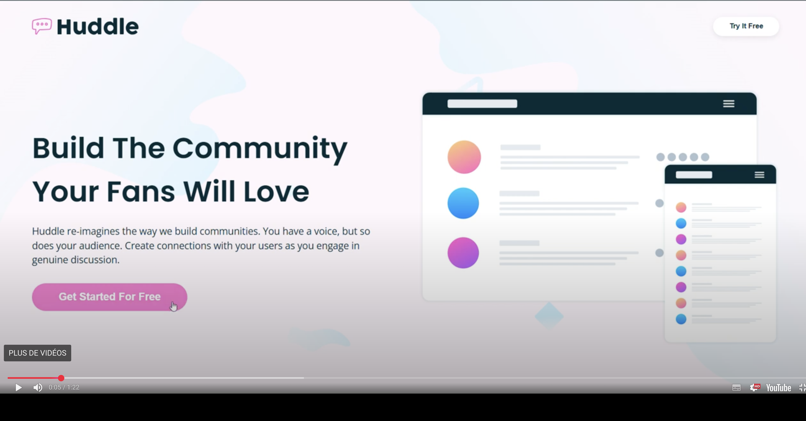
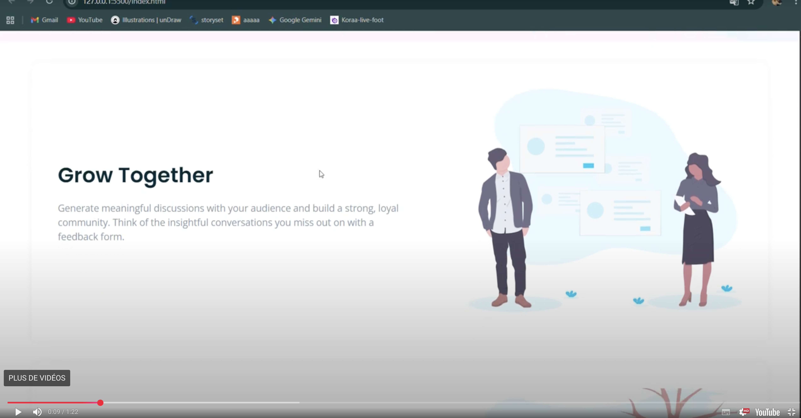

### 
le projet projet nous permet de comprendre l,apprentissage du style html.
comprendre aussi a utiliser les liens pour l,application des logos et images.
enfin de bien elaborer son projet en html.pour atteindre l,objectif ci dessous
--------------------------------------------------------------------
## objectif du projet
 ["Apprendre à structurer une page web","Apprendre à utiliser les images et les icônes","Apprendre à mettre en forme avec CSS & utiliser les polices externes","Apprendre à Structurer le contenu"]
 ## technologies utilisees.
 -html-structureturation du contenu
 -css-mise en formes alignement et responsive designe
 -flexbox-gestion fluide des alignement et espacements

 -font awesone-icone social
 --------------------------------------------------------------------------------------
 ## responsive design
 -le designe s'adopte automatiquement aux resolutions tablettes et mobiles
 -reduction des taille;police marge interne et externes de tout le blocs
 -alignement obtimiser pour une experience fluide sur tout les appareil.
 -les image et ullustrations se redimentione.
 ----------------------------------------------------------------------------------------
 ## structure du projet
 le contenu  est structurer avec des ballises html semantiques.
 
 
 
